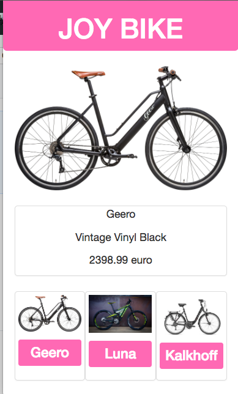

# Joy Bike 

A website dedicated to the pleasure of shopping for ebikes online.

This is just a mock-ecommerce site to integrate some of the technologies that I have been working on lately. The project is currently set up with react-redux, using only a mock-data set.

Next steps:
* Users should be able to move between different preview sets on the bottom navigation panel.
* Users should be able to see more features if they click on a features button.
* I am planning on integrating this project with a python backend.